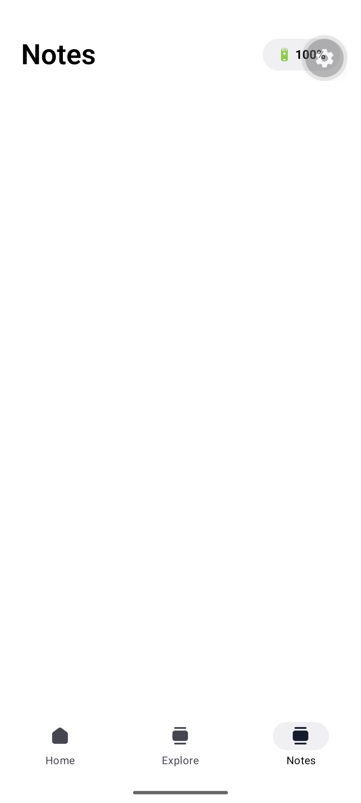
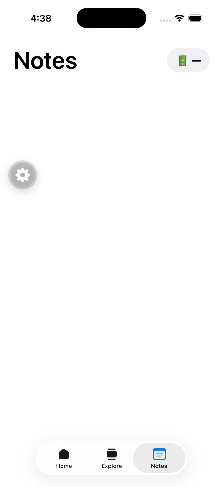

# Welcome to your Expo app 👋

This is an [Expo](https://expo.dev) project created with [`create-expo-app`](https://www.npmjs.com/package/create-expo-app).

## Get started

1. Install dependencies

   ```bash
   npm install
   ```

2. Start the app

   ```bash
   npx expo start
   ```

In the output, you'll find options to open the app in a

- [development build](https://docs.expo.dev/develop/development-builds/introduction/)
- [Android emulator](https://docs.expo.dev/workflow/android-studio-emulator/)
- [iOS simulator](https://docs.expo.dev/workflow/ios-simulator/)
- [Expo Go](https://expo.dev/go), a limited sandbox for trying out app development with Expo

You can start developing by editing the files inside the **app** directory. This project uses [file-based routing](https://docs.expo.dev/router/introduction).

## Get a fresh project

When you're ready, run:

```bash
npm run reset-project
```

This command will move the starter code to the **app-example** directory and create a blank **app** directory where you can start developing.

### Other setup steps

- To set up ESLint for linting, run `npx expo lint`, or follow our guide on ["Using ESLint and Prettier"](https://docs.expo.dev/guides/using-eslint/)
- If you'd like to set up unit testing, follow our guide on ["Unit Testing with Jest"](https://docs.expo.dev/develop/unit-testing/)
- Learn more about the TypeScript setup in this template in our guide on ["Using TypeScript"](https://docs.expo.dev/guides/typescript/)

## Learn more

To learn more about developing your project with Expo, look at the following resources:

- [Expo documentation](https://docs.expo.dev/): Learn fundamentals, or go into advanced topics with our [guides](https://docs.expo.dev/guides).
- [Learn Expo tutorial](https://docs.expo.dev/tutorial/introduction/): Follow a step-by-step tutorial where you'll create a project that runs on Android, iOS, and the web.

## Join the community

Join our community of developers creating universal apps.

- [Expo on GitHub](https://github.com/expo/expo): View our open source platform and contribute.
- [Discord community](https://chat.expo.dev): Chat with Expo users and ask questions.

## Native battery module

The **Notes** tab's header shows the device's live battery percentage, read through a
custom local Expo module rather than a third-party package.

### How it's built

| Layer | File | What it does |
| --- | --- | --- |
| iOS (Swift) | [`modules/expo-battery/ios/BatteryModule.swift`](modules/expo-battery/ios/BatteryModule.swift) | Reads `UIDevice.current.batteryLevel` via the Expo Modules API (`AsyncFunction`), returning an `Int` 0–100, or `-1` when the device can't report a level (e.g. the iOS Simulator, which has no battery). |
| Android (Kotlin) | [`modules/expo-battery/android/src/main/java/expo/modules/battery/BatteryModule.kt`](modules/expo-battery/android/src/main/java/expo/modules/battery/BatteryModule.kt) | Reads `BatteryManager.BATTERY_PROPERTY_CAPACITY` from the system `BatteryManager` service, again returning `-1` if unavailable. |
| JS/TS wrapper | [`src/native/Battery.ts`](src/native/Battery.ts) | Loads the native module via `requireNativeModule('BatteryModule')` and exposes a `useBatteryLevel()` hook that polls every 30s and refreshes whenever the app returns to the foreground. |
| UI | [`src/app/NotesScreen.js`](src/app/NotesScreen.js) | Renders a `🔋 {level}%` badge in the header using the hook above, falling back to `—` when the level is unavailable. |
| Navigation | [`src/components/app-tabs.tsx`](src/components/app-tabs.tsx) | Adds the **Notes** tab so the screen is reachable in the app. |

`modules/expo-battery` is a **local Expo module**, autolinked automatically because Expo
scans the `./modules` directory by default — no extra config needed.

> **Note:** Custom native modules like this only run inside a **development build**, not
> Expo Go. That's why this project depends on `expo-dev-client` and is launched with
> `npx expo run:android` / `npx expo run:ios` (see [Get started](#get-started)) rather than
> plain `expo start`.

### Verified on both platforms

<table>
<tr>
<td align="center" width="50%">
<br/>
<b>Android emulator</b><br/>
Real reading from <code>BatteryManager</code> — <code>🔋 100%</code>
</td>
<td align="center" width="50%">
<br/>
<b>iOS Simulator</b><br/>
Placeholder <code>🔋 —</code> — simulators report no battery, so <code>batteryLevel</code> is <code>-1</code>
</td>
</tr>
</table>
